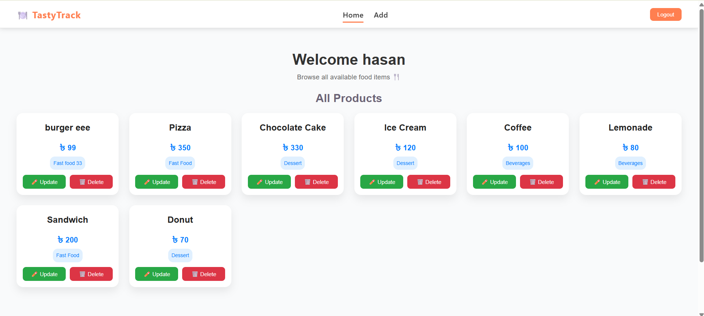
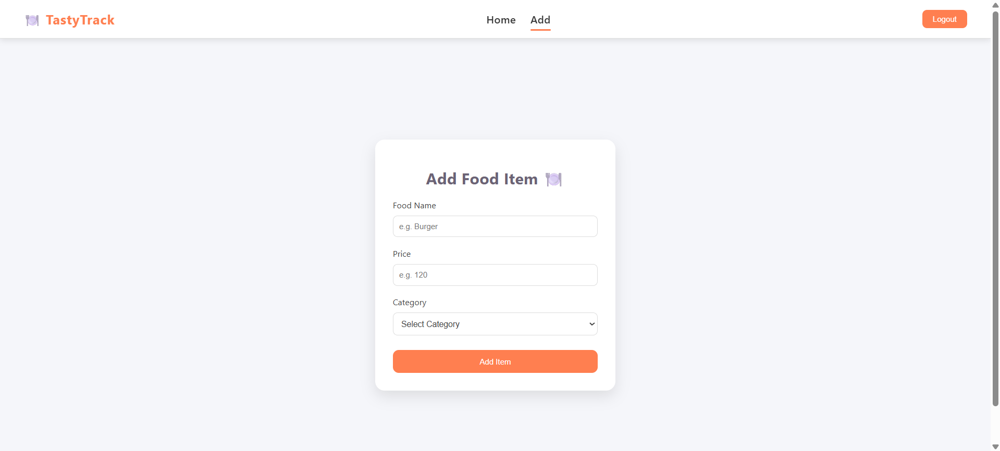
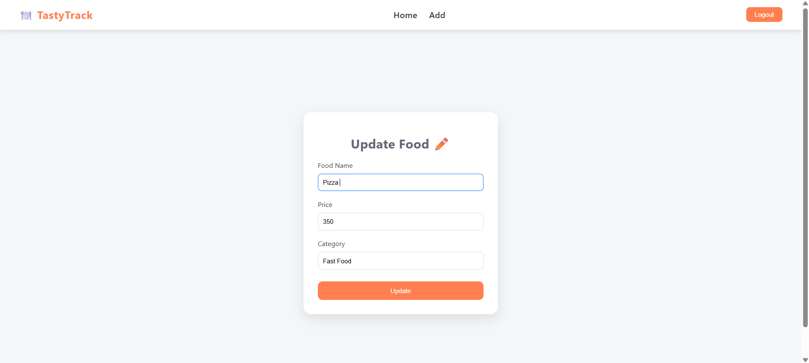

# 🍽️ TastyTrack - Food Management Dashboard

A simple and modern Food management dashboard built using Vue.js. Users can add, update, and delete food items with category and image support.

### 🚀 Features

- 🔐 User Authentication (Login & Registration using localStorage)
- ➕ Add new food items with name, price, category 
- ✏️ Update existing food items
- 🗑️ Delete food items instantly
- 📦 Data stored using JSON Server (Mock REST API)
- 🎨 Clean and responsive UI 
- 🔄 Real-time UI updates (No page reload)
- 🧭 Vue Router for navigation

### 🛠️ Tech Stack

- Frontend: Vue.js (Composition API)
- Routing: Vue Router
- HTTP Client: Axios
- Backend (Mock): JSON Server
- Styling: CSS (Custom)

---

### 📸 Screenshots

### 🔹 Home Page

### 🔹 Add Food Page

### 🔹 Update Page

<br

## ⚙️ Installation & Setup

### 1️⃣ Clone the repository

git clone https://github.com/your-username/tastytrack.git

cd tastytrack

### 2️⃣ Install dependencies
npm install
### 3️⃣ Run JSON Server
npx json-server --watch db.json --port 3000
### 4️⃣ Run Vue App
npm run dev